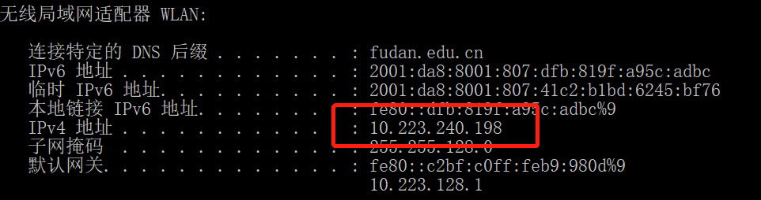

This is a test reference. You just need to input those content. If you type the wrong cipher, don't worry about it because you have three chances!
Don't forget to change your IP address!

If  your computer is connecting the wifi, I recommend you to choose the follows(after you input "ipconfig" in cmd.exe)

IP：192.168.1.103
Username：Wang Peng
PassWord：AA
Command：put test1.txt txt
Command：Y
Command：put test1.jpg jpg
Command：Y
Command：put test1.avi video
Command：Y
Command：get test2.txt txt
Command：Y
Command：get test2.jpg jpg
Command：Y 
Command：get test2.avi video

Command：N