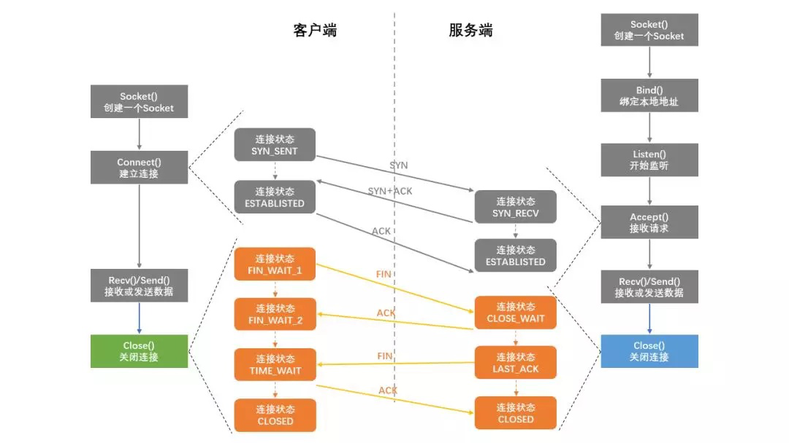
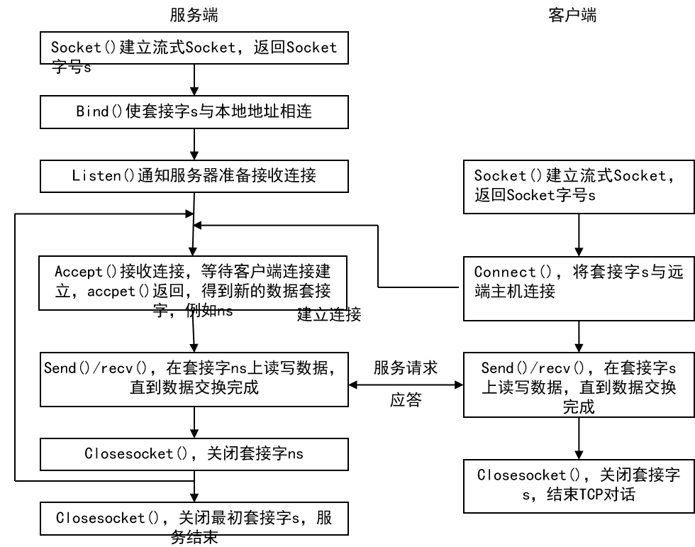
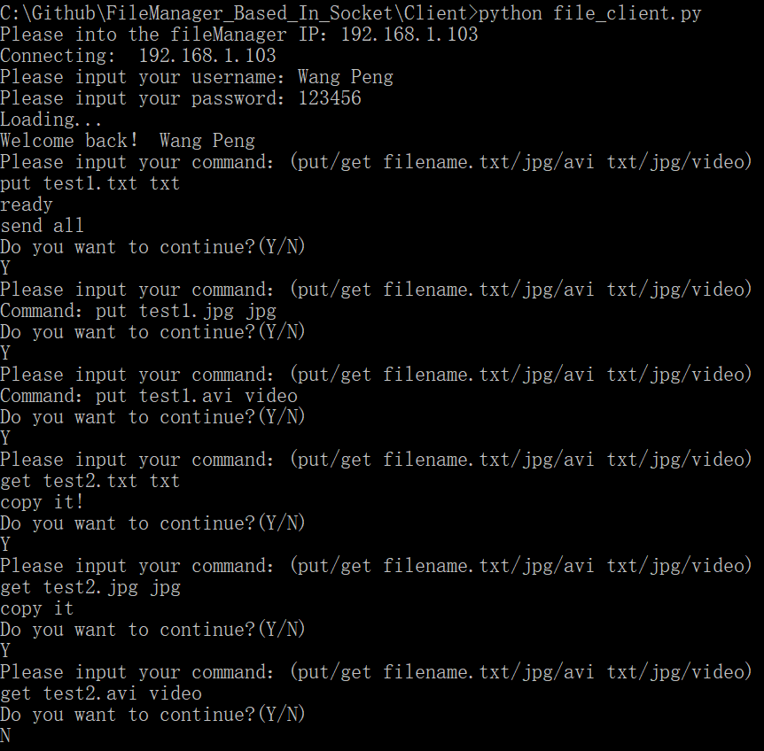

# Socket编程实验报告

[TOC]

### 1、实验原理

#### 一、Socket提出背景

无论是七层网络还是TCP/IP简化的五层网络，进行网络操作的两个进程，底层传输数据在同一机器上是没问题的，但在不同机器上是不行的

网络协议各不相同，范式、接口各不相同，要建立一种通用机制支持多种协议

基于以上两个原因，提出了socket

Socket是应用层与TCP/IP协议族通信的中间软件抽象层，它是一组接口，打包了通信协议、地址、状态等 。相当于把运输层网络层链路层看做一个黑盒，我们只关心这个黑盒的输出或者说提供的服务

Socket 的诞生是为了应用程序能够更方便的将数据经由传输层来传输，所以它本质上就是对 TCP/IP 的运用进行了一层封装，然后应用程序直接调用 socket API 即可进行通信。


#### 二、Socket的分类

1、流式套接字

有连接服务，提供可靠的、面向连接的通信流。使用TCP协议，从而保证了数据传输的正确性和顺序性。提供了一个面向连接、可靠的数据传输服务，数据无差错、无重复地发送，且按发送顺序接收。通信流（像水流一样不停传输数据）严格遵循先来后到。

面向连接服务：TCP协议提供面向连接的虚电路。建立了唯一的指定通信链路进行连接，于是数据传输过程中，各数据分组不携带目的地址，而使用连接号（connect ID）即管道号。

2、数据报套接字

无连接服务。各分组都携带完整的目的地址，在系统中独立传送。以独立包发送，不能保证分组的先后顺序，不进行分组出错的恢复与重传，不保证传输的可靠性。

无连接服务：UDP协议提供无连接的数据报服务。只给你一个地址，不告诉你怎么走，丢了就丢了，顺序也不保证 。

3、原始式套接字（SOCK_RAW）

允许对底层协议如IP或ICMP进行直接访问。


#### 三、相关概念解释

1、流控制：传输速率过大，导致某些地方拥塞，使得网络质量与稳定性变差

2、客户服务器模式：服务器要一直存在，去处理不同客户的请求

3、地位：服务器端和客户端建立连接后，地位是平等的。双方都可以收发，而且用的函数是一样的。只有在建立连接之前，服务器端更加主导，因为它在listen

4、shutdown：只是把套接字和两端的连接给断开，但还是存在且占用资源的

5、bind：把套接口和端口连接就是用bind函数

6、type：端口类型，使得套接字能够发送

7、套接口，端口，套接字：一个套接口只能绑定一个端口（对应一个进程）；一个套接字要在两端都建立连接，当中是通信链路

8、无连接协议：没有把本地套接字套接到对方，所以并没有建立全相关；也要先打开服务器端实现监听

9、半相关：在本地建立了内部连接


#### 四、TCP面向连接的协议

##### 1、完整连接过程




服务器必须首先启动，直到它执行完accept()调用，进入等待状态后，方能接收客户请求。
假如客户在此前启动，则connect()将返回出错代码，连接不成功 

TCP/IP网络应用中，通信的两个进程间相互作用的主要模式是客户/服务器模式，即客户向服务器发出服务请求，服务器接收到请求后，提供相应的服务

客户与服务器进程的作用是非对称的，服务器进程一般先于客户请求启动，并一直随系统运行而存在，直到被终止

##### 2、面向连接的套接子系统调用时序图



**服务器端**：

1.打开一通信通道并告知本地主机，它愿意在某一公认地址上（如FTP为21）接收客户请求

2.等待客户请求到达该端口

3.接收到重复服务请求，处理该请求并发送应答信号。接收到并发服务请求时，要激活一新进程来处理这个客户请求（如UNIX系统中用fork、exec）。新进程处理此客户请求，并不需要对其它请求作出应答。服务完成后，关闭此新进程与客户的通信链路，并终止

4.返回第二步，等待另一客户请求

5.关闭服务器 

**客户端**：

1.打开一通信通道，并连接到服务器所在主机的特定端口

2.向服务器发服务请求报文，等待并接收应答；继续提出请求

3.请求结束后关闭通信链路并终止


### 2、实验代码模块设计和解析

本次实验采用面向对象编程的思想进行实验。我们定义了两个类：fileClient和fileServer

#### 一、FileClient

- 初始化函数__init__(self)

  ```python
  # 创建客户的套接字。AF_INET 指示底层网络使用的IPv4，SOCK_STREAM指示套接字类型
  def __init__(self):
          self.sock = socket.socket(socket.AF_INET, socket.SOCK_STREAM)
  ```

- 连接函数connect(self, ip, port):

  ```python
  # 将服务器的端口号serverPort与该套接字关联起来
  def connect(self, ip, port):
       	self.sock.connect((ip, port))
  ```

- 命令行处理函数 input(self, command):

```python
# command 为用户输入的命令行，我们根据用户输入的信息判断执行哪一类操作
def input(self, command):
    if not command:
        return
    action, filename, filetype = command.split()
    # put代表用户需要存储文件，根据文件的类型（txt\jpg\video）执行不同的发送模式
    # 在发送之前，需要调用self.confirm(command)确认服务器是否已经准备接收数据，
    # 接到服务器指示后，返回True继续执行相应的发送模式
    if action == 'put':
        if filetype == 'txt':
            if self.confirm(command):
                self.sendFile(filename)
            else:
                pass
        elif filetype == 'jpg':
            if self.confirm(command):
                self.sendImage(filename)
            else:
                pass
        elif filetype == 'video':
            if self.confirm(command):
                self.sendVideo(filename)
            else:
                pass
        else:
            pass

    # get代表用户需要取文件，根据文件的类型（txt\jpg\video）执行不同的接收模式
    elif action == 'get':
        if filetype == 'txt':
            self.sock.send(command.encode())
            self.recvFile(filename)
        elif filetype == 'jpg':
            self.sock.send(command.encode())
            self.recvImage(filename)
        elif filetype == 'video':
            self.sock.send(command.encode())
            self.recvVideo(filename)
        else:
            pass
    else:
        pass
```

- 发送确认函数confirm(self, command)

  ```python
  def confirm(self, command):
      self.sock.send(command.encode())
      data = self.sock.recv(4096).decode()
      print(data)
      if data == 'ready':
          return True
  ```

  

- 文件发送和接收函数sendFile(self, filename)和recvFile(self, filename)

  ```python
  # sendFile 执行打开文件并且发送数据，文件发送完毕之后向服务器发送“EOF”表示传输已经完成
  def sendFile(self, filename):
      f = open(filename, 'rb')
      while True:
          data = f.read(4096)
          # print(data)
          if not data:
              print("send all")
              break
          self.sock.sendall(data)
      f.close()
      time.sleep(0.5)
      self.sock.sendall('EOF'.encode())
  # sendFile 执行打开文件并且写入接收的数据，收到“EOF”表示传输已经完成
  def recvFile(self, filename):
      f = open(filename, 'wb')
      while True:
          data = self.sock.recv(4096).decode()
          if data == 'EOF':
              print('copy it!')
              break
          f.write(data.encode())
      f.close()
  ```

- 图片发送和接收函数sendImage(self, filename)和recvImage(self, filename)

```python
def sendImage(self, filename):
    f = open(filename,'rb')
    while True:
        data = f.read(4096)
        # print(data)
        if not data:
            print("send all")
            break
        self.sock.sendall(data)
    f.close()
    time.sleep(1)
    self.sock.sendall('EOF'.encode())

def recvImage(self, filename):
    f = open(filename, 'wb')
    while True:
        data = self.sock.recv(1024)
        # print(data)
        if data == b'EOF':
            print('copy it')
            break
        f.write(data)
    f.close() 
```

- 视频发送和接收函数sendVideo(self, filename)和recvVideo(self, filename)

```python
def sendVideo(self, filename):
    f = open(filename,'rb')
    while True:
        data = f.read(4096)
        # print(data)
        if not data:
            print("send all")
            break
        self.sock.sendall(data)
    f.close()
    time.sleep(1)
    self.sock.sendall('EOF'.encode())
def recvVideo(self, filename):
    f = open(filename, 'wb')
    while True:
        data = self.sock.recv(1024)
        # print(data)
        if data == b'EOF':
            break
        f.write(data)
    f.close()
```

- 发送用户密码sendCipher(self, cipher)

  ```python
   # 将用户输入的密码发送给服务器，服务器收到密码后进行核对，如果正确就会发送“right”
  def sendCipher(self, cipher):
      self.sock.send(cipher.encode())
      data = self.sock.recv(4096).decode()
      if data == 'right':
          return True
      else:
          return False
  ```

  

#### 二、fileServer

- 用户请求处理函数handle(self)

  ```python
  # put代表用户需要存储文件，根据文件的类型（txt\jpg\video）执行不同的接收模式
  # get代表用户需要取文件，根据文件的类型（txt\jpg\video）执行不同的发送模式
  def handle(self):
      # 显示连接对象
      print("get connection from :",self.client_address)
      while True:
          try:
              # 接收用户请求
              data = self.request.recv(1024).decode()
              print("get client command:", data) 
              if not data:
                  print("break the connection")
                  break                
              else:
  
                  action, filename, filetype = data.split()
                  if action == "put":
                      if filetype == 'txt':
                          self.recvfile(filename)
                      elif filetype == 'jpg':
                          self.recvImage(filename)
                      elif filetype == 'video':
                          self.recvVideo(filename)
                      else:
                          pass
                  elif action == 'get':
                      if filetype == 'txt':
                          self.sendfile(filename)
                      elif filetype == 'jpg':
                          self.sendImage(filename)
                      elif filetype == 'video':
                          self.sendVideo(filename)
                      else:
                          pass 
                  else:
                      print("get error when action!")
                      continue
          except Exception:
              print("The client has quit! Over")
              break
  ```

- 文件发送和接收函数sendFile(self, filename)和recvFile(self, filename)

  ```python
  def recvfile(self, filename):
      print("start recv")
      f = open(filename, 'wb')
      # 在接收之前服务器向用户发出确认信号
      self.request.send('ready'.encode())
      while True:
          data = self.request.recv(1024).decode()
          # print(data)
          if data == 'EOF':
              print("recv success")
              break
          f.write(data.encode())
      f.close()
  
  def sendfile(self, filename):
      print("start send")
      try:
          f = open(filename, 'rb')
          while True:
              data = f.read(1024)
              if not data:
                  break
              # print(data)
              self.request.send(data)
          f.close()
          time.sleep(0.5)
          self.request.send('EOF'.encode())
          print("send success")
      except:
          self.request.send('EOF'.encode())
  ```

- 图片发送和接收函数sendImage(self, filename)和recvImage(self, filename)

```python
def recvImage(self, filename):
    print("start recv")
    f = open(filename, 'wb')
    self.request.send('ready'.encode())
    while True:
        data = self.request.recv(1024)
        # print(data)
        if data == b'EOF':
            print("recv success")
            break
        f.write(data)
    f.close()
def sendImage(self, filename):
    print("start send")
    # self.request.send('ready'.encode())
    try:
        f = open(filename, 'rb')
        while True:
            data = f.read(1024)
            if not data:
                break
            # print(data)
            self.request.send(data)
        f.close()
        time.sleep(0.5)
        self.request.send('EOF'.encode())
        print("send success")
    except:
        self.request.send('EOF'.encode())
```

- 视频发送和接收函数sendVideo(self, filename)和recvVideo(self, filename)

```python
def recvVideo(self, filename):
    print("start recv")
    f = open(filename, 'wb')
    self.request.send('ready'.encode())
    while True:
        data = self.request.recv(1024)
        # print(data)
        if data == b'EOF':
            print("recv success")
            break
        f.write(data)
    f.close()
def sendVideo(self, filename):
    print("start send")
    # self.request.send('ready'.encode())
    try:
        f = open(filename, 'rb')
        while True:
            data = f.read(1024)
            if not data:
                break
            # print(data)
            self.request.send(data)
        f.close()
        time.sleep(0.5)
        self.request.send('EOF'.encode())
        print("send success")
    except:
        self.request.send('EOF'.encode())
```

- 密码确认函数confirm(self,cipher)

  ```python
  # 服务器收到密码后将会和初始密码进行比对，如果相同则发送“right”
  def confirm(self,data):
      init_password = "AA"
      if data == init_password:
          self.request.send('right'.encode())
      else:
          self.request.send('wrong'.encode())
  ```

#### 三、握手方式

对于用户，我们使用了python的socket库；对于服务器，我们使用了python的socketserver库

```python
# 用户
fc = fileClient()
IP_fileManager = input("Please into the fileManager IP：")
print ("Connecting: ", IP_fileManager)
fc.connect(IP_fileManager, 1010)
# 服务器
host = '192.168.1.103'
port = 1010
s = socketserver.ThreadingTCPServer((host,port), FileTcpServer)
s.serve_forever()
```

#### 四、用户界面设计

为了使文件服务管理器更接近真实使用的情况，我们设置了登录名和登录密码，用户登录流程如下：

1. 输入IP地址，连接到服务器

2. 输入用户名Wang Peng，如果输入错误，则系统要求其重新输入

3. 输入用户密码AA，如果输入错误，则系统要求重新输入，如果超过三次输入错误，则系统自动退出。

4. 正确输入密码后，登录成功，用户将被希望输入以下内容：

   put test1.txt txt
   Y
   put test1.jpg jpg
   Y
   put test1.avi video
   Y
   get test2.txt txt
   Y
   get test2.jpg jpg
   Y 
   get test2.avi video

下面是对我们程序的详细解释:

- 主函数__main__()

```python
if __name__ == '__main__':
    fc = fileClient()
    IP_fileManager = input("Please into the fileManager IP：")
    print ("Connecting: ", IP_fileManager)
    fc.connect(IP_fileManager, 1010)
    # 初始用户名，初始密码由服务器保管
    init_usrname= "Wang Peng"
    flag0=0
while True:    
    nameClient = input("Please input your username：")
    # 如果用户名输入正确
    if nameClient==init_usrname:
        # 限制三次输入的机会
        while flag0<3:
            # 对输入内容加密
            passWord = encryption()
            # fc.sendCipher(passWord)将密码发送给服务器以确认输入密码是否正确
            if fc.sendCipher(passWord):
                print("Loading...")
                print("Welcome back！",nameClient)
                try:
                    while True:
                        command = input("Please input your command：(put/get filename.txt/jpg/avi txt/jpg/video)\n")
                        fc.input(command)
                        YN = input("Do you want to continue?(Y/N)\n")
                        if(YN == 'N'):
                            break
                        elif(YN == 'Y'):
                            continue
                        else:
                            print("Input error! Quit")
                            break
                except:
                    print('error! Quit')
            else:
                # 输错以此密码，机会减1
                flag0+=1
                if flag0<=2:
                    print('\r')
                    print('Wrong Password,enter again!')
        # 输错三次，系统自动退出
        print('\r')
        print("You have tried three times, Quit")
        sys.exit(0)
    else:
        print ('Wrong Username,enter again!')
```

- 输入密码加密函数encryption():

```python
#密码星号打印
def encryption():
    import msvcrt, os
    print('Please input your password：', end='', flush=True)
    li = []
    while 1:
        ch = msvcrt.getch()
        #回车
        if ch == b'\r':
            return b''.join(li).decode() #把list转换为字符串返回
            break
        #退格
        elif ch == b'\x08':
            if li:
                li.pop()
                msvcrt.putch(b'\b')
                msvcrt.putch(b' ')
                msvcrt.putch(b'\b')
        #Esc
        elif ch == b'\x1b':
            break
        else:
            li.append(ch)
            msvcrt.putch(b'*')
    return b''.join(li).decode()
```


### 3、实验结果

###### 一、客户端



###### 二、服务器端


###### 三、添加密码后的用户界面


### 4、实验总结

我们认为这是一次非常有意思的编程实验,我参考的书籍是计算机网络(自顶向下的方法).我们的做法流程是

1 先让两台机器互相连接,这里我们犯的最大一个错误是没有正确的输入IP地址,我们之前采取的方法是百度直接搜索本地的IP地址,结果百度给我们返回了我们的路由器的IP地址,这显然是错误的,然而我们并没有发现,这也是我为什么在使用指南强调了这一点,因为当我们向cmd输入ipconfig我们会同时收到多个ip地址,如果电脑使用wifi连接,那么应该选择无限局域网WLAN.

2 先定一个小目标,实现传输文本.传输并不难,只要两台电脑握手成功后,数据传输就没有任何问题,关键问题出现在对数据的编解码,文本传输需要先转换为b''类型,然后收到数据后转换为字符串.但是比较坑的地方是f.write(data).这里的data需要先转换为b''才能进行写入.这是非常容易混淆的地方.

3 传输文本实现后,进行图片传输,图片编码是16进制的数据uint16,因此不是字符串,不能使用data.encode().因此encode()和decode()只针对于字符串.令人庆幸地是我们不需要知道这些数据是什么,我们只需要读出写入.

4 视频传输在图片传送成功的基础上进行已经非常容易了,所以基本上没有遇到什么困难.

5 用户密码输入和传输是我认为是文件管理服务器的一个比较重要的点,但是我认为还有很多地方可以完善,比如注册用户名和密码,其次可以添加验证码.然后服务器保管密码的方式也不对,按理讲,用户输入的密码服务器也不应该知道是什么,由于时间关系我并没有仔细研究,这和我们的课程学习也没有很大的关系.

### 5、使用指南

- Download the two folders and same them respectively on two different machines

- Change the IP address in the file_server.py. Here is the position! I recommend you should input **ipconfig** in a cmd window and then you could get the IP of host!  Remember that you should input the same IP address in the client-user-window.

  

- Go to the /Server and run the  **Run_me_to_activate_server.bat** which is used to run file_server.py before you have finished the above tips. Now the server is running and thus the client can send request to the server.

- Go to the /Client and run the **Run_me_to_login.bat** which is used to run file_client.py Now the client is activated. Just follow the instructions.

  This is a test reference. You just need to input those content. If you type the wrong cipher, don't worry about it because you have three chances!
  Don't forget to change your IP address! Please note that this is the server IP . 

  If  your computer is connecting the wifi, I recommend you to choose the follows(after you input "ipconfig" in cmd.exe)


IP：10.223.240.198
Username：Wang Peng
PassWord：AA
Command：put test1.txt txt
Command：Y
Command：put test1.jpg jpg
Command：Y
Command：put test1.avi video
Command：Y
Command：get test2.txt txt
Command：Y
Command：get test2.jpg jpg
Command：Y 
Command：get test2.avi video

Command：N

- Untill now, congratulationsions!  you have done all the test! 
- I would appreciate it if you could  give me a star.